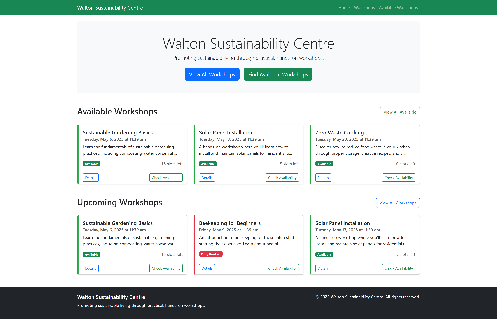

# Walton Sustainability Centre

## Background
Each month my employer gives us a dedicated *free-play / learning* day. With the arrival of **JetBrains Junie**, I’m using 
today's (29 April 2025) free-play to see how well Junie handles a project where the **requirements themselves live under source control 
right alongside the code**.

The testbed is a [set of requirements my MSc tutor group wrote back in 2017](https://github.com/Open-University-PG-SWEng/M814-16K-Foley) (back when I was studying for my Masters): a set of functional 
and non-functional requirements for a fictional **Sustainability Centre**. By resurrecting that spec—and tracking every 
edit in Git—I can judge how Junie copes when the full story (code *and* evolving requirements) sits in one repo.

## About Walton Sustainability Centre

Walton Sustainability Centre is a fictional community-focused education venue in the UK that promotes sustainable living 
through practical, hands-on workshops. The Centre:

- **Delivers scheduled, fee-paying workshops** open to the public.
- **Runs an annual membership scheme** that grants discounted booking rates and other perks.
- **Processes payments in-house**, supporting card transactions and bank transfers while keeping invoicing up-to-date.
- **Maintains a small inventory** of teaching equipment and consumables, raising purchase orders as required.
- **Produces routine and ad-hoc management reports** for staff, trustees and auditors.
- **Ensures full compliance with the UK Data Protection Act**, enforcing strict access controls around personal and payment data.

| Note                                                                     |
|--------------------------------------------------------------------------|
| Chat-GPT managed to glean this description by scanning the requirements. |

## Where to find the requirements

| Scope | Location | Format |
|-------|----------|--------|
| **Functional requirements** | `WaltonSustainabilityCentre-Requirements.txt` (repository root) | Single plain-text file, one requirement per “REQ-ID” entry. |
| **Non-functional requirements** | `NonfunctionalRequirements/` | Folder of plain-text files (`NFR-x-*.txt`), one file per requirement plus a template for new items. |

Both sets are human-readable text so they can be diffed and reviewed like code. Any future updates should follow the same 
naming conventions (see example below) to keep the documentation consistent.

```text
REQ-ID:
Description:
Type:
Rationale:
Fit Criterion:
Originator:
Comments: [M814-ModuleChair] Add comments below, making sure to include your initials in [] at the start.
```

## Timeline for the day:
**9am - begin setting up the project**
- Forced original repo
- Adds SpringBoot via the Initializer.
- Made README with Chat-GPT to have a goal.
- Wrote the .junie/guidelines.md as an attempt to steer Junie's decisions.

**11am - begin coding**
1. Ask Chat-GPT what would be a good starting point.
```text
As you have read the requirements what REQ-ID do you think would be the best one to do first? At this point no code has been written, but Spring Boot has been set up. 
```
It responded with:
```text
Start with REQ-ID `FR-32 – “The product shall check the availability of the workshop.”...
```
I then asked Junie:
```text
Please implement REQ-ID: FR-32. As this project is new, you may add demo data so that workshops that are not in the past are displayed and indicate whether they are available or not, as per the requirement.
```
Junie then wrote the following files in the order given (top-down):
- application.properties
- The Workshop Entiey
- The Workshop Repository
- The Workshop DTO
- The Workshop Service
- The Workshop Controller
- main.html (a base UI layout)
- The Workshops list.html
- The Workshop available.html
- The Workshop details.html
- The Workshop availability.html
- A HomeController
- a home.html (homepage)
- V1_Create_workshops_table (flyway migration script) 
- (and then I didn't note anymore)

The full list of changes can be found [here](https://github.com/GeoffreyHayward/M814-16K-Foley/pull/1)

Here are the tests it added:
Here are the test method names from the image:
- testGetAvailableWorkshops()
- testGetAllWorkshops()
- testIsWorkshopAvailable()
- testGetUpcomingWorkshops()
- testGetAvailableSlots()
- testGetPastWorkshops()
- testGetWorkshopById()
- testGetFullyBookedWorkshops()

And running the application, I got a working website. Here is the homepage:



Junie also added a developer guide Markdown file and a user manual Markdown file.

**12pm - check the PR I created from Junie's work **
Here are my notes:
1. Oddly it disabled CSRF, I allow it, but keep an eye on this.
```java
@Configuration
@EnableWebSecurity
public class SecurityConfig {

    /**
     * Configures the security filter chain.
     * For now, we're disabling CSRF protection and allowing all requests without authentication.
     *
     * @param http The HttpSecurity to configure
     * @return The configured SecurityFilterChain
     * @throws Exception If an error occurs during configuration
     */
    @Bean
    public SecurityFilterChain securityFilterChain(HttpSecurity http) throws Exception {
        http
            .csrf(csrf -> csrf.disable())
            .authorizeHttpRequests(auth -> auth
                .anyRequest().permitAll()
            );

        return http.build();
    }
}
```

2. It added some inline CSS in the main.html, I allow it for now (as only a test).
```html
<!-- Custom CSS -->
    <style>
        .workshop-card {
            height: 100%;
            transition: transform 0.3s;
        }
        .workshop-card:hover {
            transform: translateY(-5px);
        }
        .available {
            border-left: 5px solid #28a745;
        }
        .unavailable {
            border-left: 5px solid #dc3545;
        }
        .past {
            border-left: 5px solid #6c757d;
        }
    </style>
```

3. Happy to approve, as only testing and things look generally good. 

**12:30pm - Lunchtime**